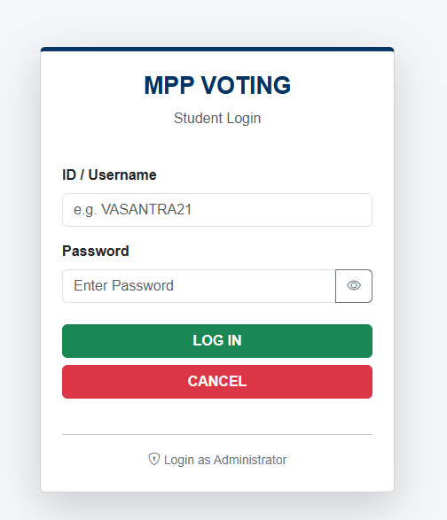
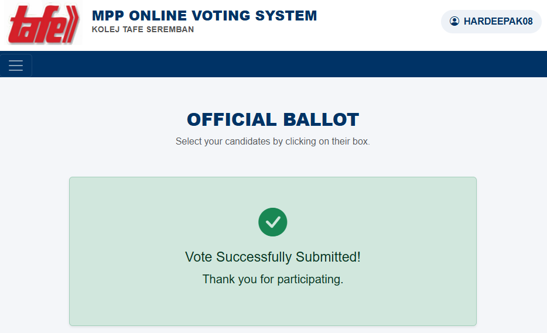
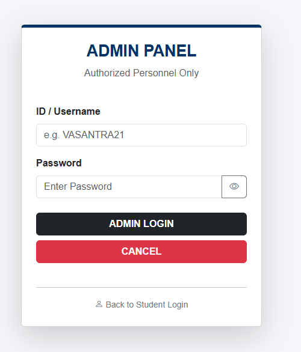

# MPP Online Voting System 🗳️

A complete web-based voting system built with **Google Apps Script** and **Google Sheets**. It features a student login, visual ballot paper, and a real-time Admin Dashboard with charts.

## Features
- 🔐 **Secure Login:** Separate login for Voters and Admins.
- 📱 **Responsive Design:** Works on phones and laptops (Bootstrap 5).
- 📊 **Admin Dashboard:** Real-time charts of election results.
- 🖼️ **Auto-Image Handling:** Automatically converts Google Drive image links to visible photos.
- 🛡️ **Security:** Prevents double voting.

## 🚀 How to Install

### 1. Database Setup (Google Sheets)
1. Create a new Google Sheet.
2. Create 3 Tabs (at the bottom): `Voters`, `Candidates`, `Admins`.
3. **Setup Columns exactly like this:**

**Tab: Voters**
| Column A | Column B | Column C | Column D |
| :--- | :--- | :--- | :--- |
| **Username** | **Password** | **HasVoted** | **Timestamp** |

**Tab: Candidates**
| Col A | Col B | Col C | Col D | Col E | Col F |
| :--- | :--- | :--- | :--- | :--- | :--- |
| **ID** | **Name** | **Position** | **Course** | **ImageURL** | **Votecount** |

**Tab: Admins**
| Column A | Column B |
| :--- | :--- |
| **AdminID** | **Password** |

### 2. Code Setup
1. Inside your Google Sheet, go to **Extensions** > **Apps Script**.
2. Create the files listed in this repository (`Code.gs`, `Index.html`, etc.).
3. Copy and paste the code from this GitHub repo into those files.
4. **Important:** In `Code.gs`, ensure the sheet names match exactly (`Voters`, `Candidates`, etc.).

### 3. Deploy
1. Click **Deploy** > **New Deployment**.
2. Select **Web App**.
3. Set **Who has access** to "Anyone".
4. Click **Deploy** and share the URL with students!

## 📸 Screenshots

### 1. Login Page

### 2. Voting Grid

### 3. Admin Dashboard

